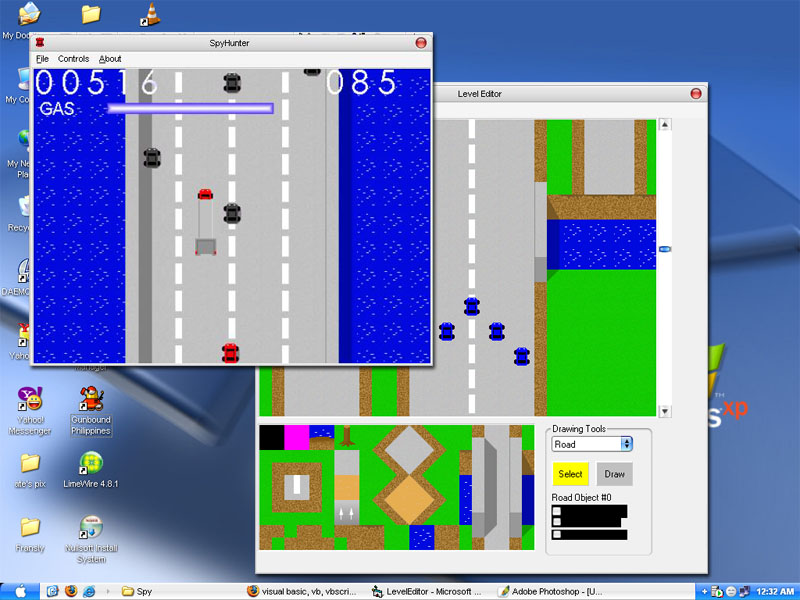

## SpyHunter\-Type Game

### Description

This is a SpyHunter-like game with a very simple tile-based engine running on DirectX7 for scaling effects. It also comes with its map editor.
 
### More Info
 

             |
---                |---
**Submitted On**   |2005-06-13 15:59:40
**By**             |[David Santos](https://github.com/Planet-Source-Code/PSCIndex/blob/master/ByAuthor/david-santos.md)
**Level**          |Intermediate
**User Rating**    |5.0 (10 globes from 2 users)
**Compatibility**  |VB 5\.0, VB 6\.0
**Category**       |[Games](https://github.com/Planet-Source-Code/PSCIndex/blob/master/ByCategory/games__1-38.md)
**World**          |[Visual Basic](https://github.com/Planet-Source-Code/PSCIndex/blob/master/ByWorld/visual-basic.md)
**Archive File**   |[SpyHunter\-19501511212005\.zip](https://github.com/Planet-Source-Code/david-santos-spyhunter-type-game__1-63334/archive/master.zip)

